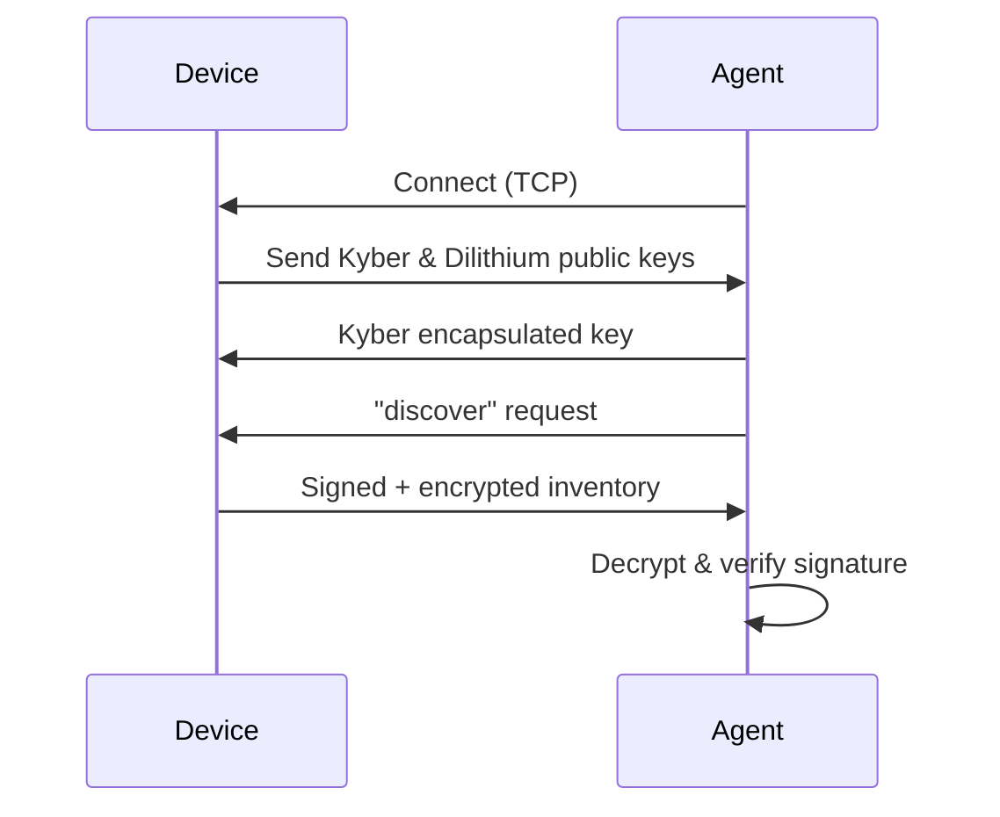

# Discovery using Post Quantum Cryptography

This project demonstrates a secure IoT device discovery and inventory system using post-quantum cryptography (PQC) primitives: Kyber (for key exchange) and Dilithium (for digital signatures). It works by simulating a device (server) and a discovery agent (client) exchanging and verifying signed, encrypted inventory data.

## File Overview

### 1. `demo_runner.py`
- **Purpose:** Runs the client and sever file and starts the demo
- **How it works:** Launches both the device (server) and the discovery agent (client) in separate threads, running `device_client.py` and `discovery_server.py`.

### 2. `device_client.py`
- **Purpose:** Simulates an IoT device/server that responds to discovery requests.
- **How it works:** Waits for a connection from the discovery agent, performs a Kyber key exchange, and sends a signed (Dilithium), encrypted inventory payload to the agent. Uses `sign_inventory.py` to prepare the payload.

### 3. `discovery_server.py`
- **Purpose:** Simulates the discovery agent/client that scans for devices and verifies their inventory.
- **How it works:** Connects to the device, performs a Kyber key exchange, requests the inventory, receives the signed/encrypted payload, and verifies it using `verify_inventory.py`.

### 4. `inventory_utils.py`
- **Purpose:** Provides mock inventory data and utility functions for device inventory.

### 5. `key_exchange_utils.py`
- **Purpose:** This file has the functions to generate Kyber KEM keypairs, encapsulate/decapsulate shared secrets, and derive AES keys for symmetric encryption.

### 6. `dilithium_utils.py`
- **Purpose:** This file has the functions to generate Dilithium keypairs, sign messages, and verify signatures.

### 7. `sign_inventory.py`
- **Purpose:** Prepares a signed and encrypted inventory payload for secure transmission.
- **How it works:** Serializes the inventory, signs it with Dilithium, and encrypts the signed payload using AES-GCM with a shared key from the Kyber exchange.

### 8. `verify_inventory.py`
- **Purpose:** Decrypts and verifies the received inventory payload.
- **How it works:** Decrypts the AES-GCM payload, extracts and verifies the Dilithium signature, and returns the inventory data if valid.

### 9. `test_invalid_signature.py`
- **Purpose:** Tests the system's ability to detect tampered or invalid signatures.
- **How it works:** Creates a valid signed/encrypted payload, then deliberately tampers with it to ensure that signature verification fails as expected.

### 10. `inventory_result.txt`
- **Purpose:** This contains the result of the discovery.

---

## How to Run the Demo

1. **Install dependencies** .
2. **Run the demo using python demo_runner.py**

## Project Flow Diagram

---

